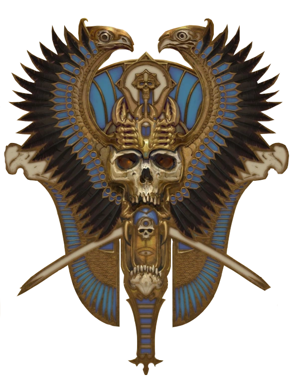

# Reyes Funerarios (Tomb Kings) — Datos 2025

Fuente: [Nuffle Zone — Reyes Funerarios](https://nufflezone.com/equipos-blood-bowl/reyes-funerarios/) · verificado con [Blood Bowl Base — Tomb Kings](https://bloodbowlbase.ru/bb2025/teams/Tomb_Kings/) (roster BB2025 reescrito).

## Roster 2025

| CTD | Posición | Coste | MV | FU | AG | PS | AR | Habilidades (resumen) | Pri | Sec |
|-----|-----------|-------|----|----|----|----|-----|------------------------|-----|-----|
| 0-16 | Esqueleto Línea | 40k | 5 | 3 | 4+ | 6+ | 8+ | Cabeza dura, Regeneración | G | ADF |
| 0-2 | Thrower de Reyes Funerarios | 65k | 6 | 3 | 4+ | 3+ | 9+ | Cabeza dura, Manos seguras, Pasar, Regeneración | GP | ADF |
| 0-2 | Blitzer de Reyes Funerarios | 85k | 6 | 3 | 4+ | 5+ | 9+ | Cabeza dura, Placar, Regeneración | GF | AD |
| 0-4 | Guardián de la Tumba (Tomb Guardian) | 115k | 4 | 5 | 5+ | 6+ | 10+ | Descomposición, Luchador, Regeneración | F | AG |

- **Rerolls:** 60k  
- **Apotecario:** No  
- **Reglas especiales:** Señores de los No Muertos  
- **Liga:** Selectiva de Sylvania  

## Descripción oficial de las habilidades

* **Cabeza dura (Thick Skull) — incl.:** En tirada de Heridas: Inconsciente solo con 9; 8 = Aturdido. Con Escurridizo: Inconsciente con 8, 7 = Aturdido.
* **Descomposición (Decay) — incl.:** +1 a todas las tiradas de Lesiones contra este jugador.
* **Luchador (Brawler) — incl.:** En Placaje puede repetir un único resultado de «Ambos derribados».
* **Manos seguras (Sure Hands) — incl.:** Puede repetir D6 al recoger el balón (no Asegurar el balón). Robar balón no puede usarse contra él.
* **Pasar (Pass) — incl.:** Puede repetir cualquier chequeo de Pase fallido en una acción de Pase.
* **Placar (Block) — incl.:** En placaje con «Ambos derribados» puede elegir no ser derribado.
* **Regeneración (Regeneration) — incl.:** Al sufrir Lesión: 1D6; 4+=se ignora la lesión y va a reservas; 1-3=normal.
