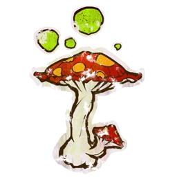

# Snotlings — Datos 2025

Fuente: [Nuffle Zone — Snotlings](https://nufflezone.com/equipos-blood-bowl/snotlings/)

## Roster 2025

| CTD | Posición | Coste | MA | FU | AG | PA | AR | Habilidades (resumen) | Pri | Sec |
|-----|-----------|-------|----|----|----|----|-----|------------------------|-----|-----|
| 0-16 | Snotling Línea | 15k | 5 | 1 | 4+ | 6+ | 6+ | Humanoide Bala, Escurridizo, Titchy | AD | GMF |
| 0-2 | Fungus Flinga | 30k | 5 | 1 | 4+ | 6+ | 6+ | Humanoide Bala, Escurridizo, Titchy, Lanzar Compañero | AD | GMF |
| 0-2 | Stilty Runna | 25k | 7 | 1 | 4+ | 6+ | 6+ | Humanoide Bala, Escurridizo, Titchy, Esprintar | A | DGMF |
| 0-2 | Pump Wagon | 80k | 5 | 5 | 5+ | 6+ | 9+ | Arma Secreta, Golpe Mortífero(+1), Juggernaut, Sin Manos, Volátil | F | AGD |
| 0-2 | Troll Entrenado | 95k | 4 | 5 | 5+ | 5+ | 10+ | Golpe Mortífero, Lanzar Compañero, Proyectil Vómito, Realmente Estúpido, Regeneración, Siempre Hambriento | F | AGP |
| 0-2 | Riotous Rookie | 40k | 5 | 2 | 4+ | 6+ | 7+ | Humanoide Bala, Escurridizo, Titchy, Lanzar Compañero | AD | GMF |

- **Rerolls:** 60k  
- **Apotecario:** Sí  
- **Reglas especiales:** Soborno y Corrupción  
- **Liga:** Reyerta en las Yermas  

## Descripción oficial de las habilidades

* **Arma Secreta (Secret Weapon) — incl.:** Al final de la entrada en que haya participado, es Expulsado.
* **Canijo (Titchy) — incl.:** +1 AG para esquivar; rivales no aplican -1 por marcarlo al esquivar para salir de su zona.
* **Escurridizo (Stunty) — incl.:** No sufre -1 por estar marcado al esquivar; -1 AG al interceptar; tirada de Heridas en tabla Escurridizos.
* **Esprintar (Sprint) — incl.:** Una vez por movimiento puede forzar la marcha una vez más.
* **Golpe Mortífero (Mighty Blow) — incl.:** Al derribar en Placaje puede aplicar +1 a tirada de Armadura o de Heridas (decidir después de tirar).
* **Humanoide Bala (Right Stuff) — incl.:** Puede ser lanzado por compañero con Lanzar compañero (incluso tumbado).
* **Imparable (Juggernaut) — incl.:** En Penetración: «Ambos derribados» → Empujón; rival no puede usar Forcejear, Mantenerse Firme ni Zafarse.
* **Lanzar Compañero (Throw Team-Mate) — incl.:** Puede declarar la acción de Lanzar compañero.
* **Proyectil Vómito (Projectile Vomit) — incl.:** Acción especial: rival adyacente, 1D6; 2+=tirada Armadura no modificada; 1=tirada contra él.
* **Realmente Estúpido (Really Stupid) — incl.:** Al activarse: 1D6 (+2 si adyacente a compañero en pie sin este rasgo); 4+=normal, 1-3=Distraído.
* **Regeneración (Regeneration) — incl.:** Al sufrir Lesión: 1D6; 4+=se ignora la lesión y va a reservas; 1-3=normal.
* **Sin Manos (No Hands) — incl.:** No puede ser portador del balón; no puede atrapar, recoger ni interceptar el balón.
* **Siempre Hambriento (Always Hungry) — incl.:** Antes del chequeo de Lanzar compañero: 1D6; 1=intenta comerse al compañero (segundo 1D6: 1=devorado).
* **Volátil (Volatile) — incl.:** Cuando sale del campo (KO, expulsión, etc.) se hace una tirada en la tabla de heridas contra él.
